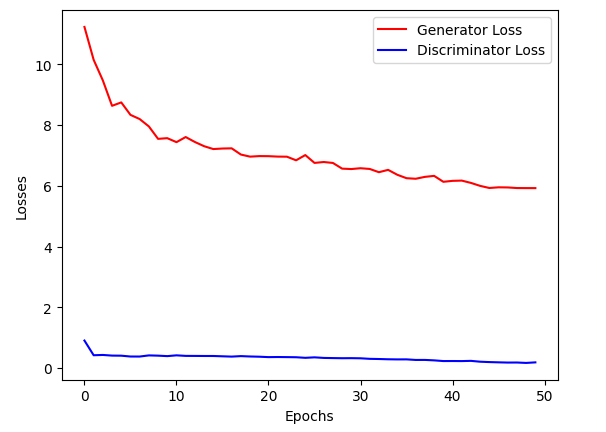
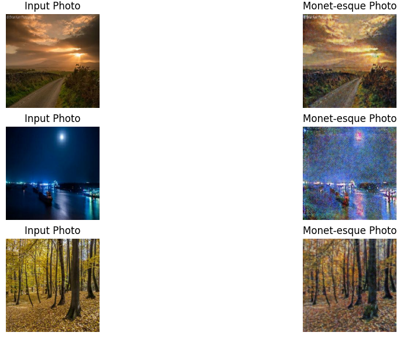

# CycleGAN Study

The challenge is to build a GAN that generates 7,000 to 10,000 Monet-style images. The plan is to build a generator neural network model to create images in the style of Monet. The images will be trained using a discriminator model. The source data to run this notebook can be found at: https://www.kaggle.com/competitions/gan-getting-started. 

For the GAN, the generator was a ResNet-based Generative Convolutional Neural Network optimized for tasks like style transfer. The discriminator model was a PatchGAN-based CNN that operates on local patches of the input image instead of the entire image, which helps it focus on small-scale details and makes it suitable for tasks like style transfer. The Resblock class was a building block for the ResNet by making sure the input and output have the same number of features, making it a residual block that helps prevent vanishing gradients. The GAN Class pulled together all the functions and classes for execution.

By epoch 50, both generator and discriminator losses plateaud. The generator loss was higher than the discriminator loss, which was expected. The generator is trying to fool the discriminator, so it has to work harder. The discriminator, on the other hand, is trying to distinguish between real and fake images, so it has an easier job. The model can be further trained for more epochs to improve the quality of the generated images.

